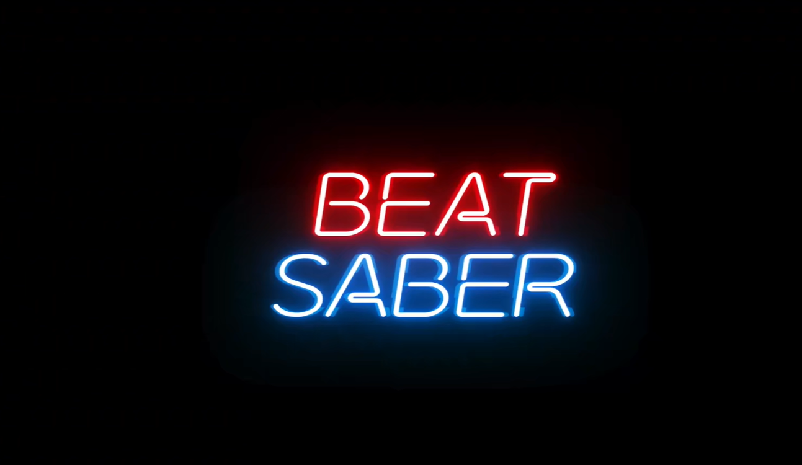
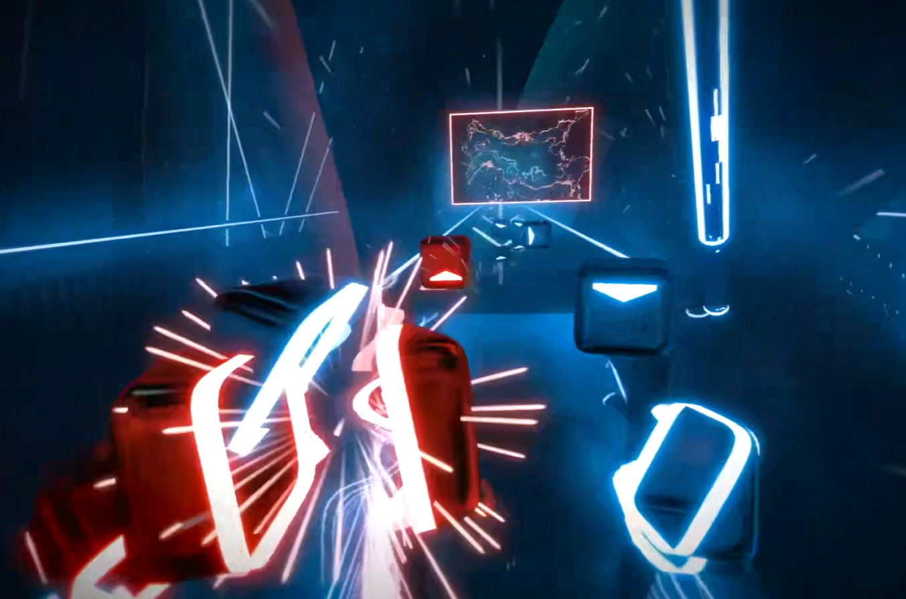

## Project planning
### Intro and Goal
I'm a rhythm game lover and I'm thinking of generating a cool music game with typical rhythm game gameplay design and many cool music visualization effects.
My goal is to build a game like a simplified beat-saber with some cool line-based visualizations.
some references.

### Reference



### Specification
The game would have:
- some crazy beat saber-style visualizations cooperating with the music
- a basic rhythm game gameplay such as project sekai or phigros
- some PCG chart for any music input

### Techniques
- I may decompose the music component(highs and lows, kick and drums, bpm, etc) by fourier transform to cotroll the visualization.
- I'll use some noise functions to create more visual effects.
- I might determine the basic notes(tap, hold, etc) of the chart, set a bunch of basic rules(such as there are only two notes that will occur at a time).
And I'll use the drum and kick to determine the must-have notes and fill the other parts based on wave function decompose0
- I'll somehow try to catch the emotion of the music(pitch of human voice, overall volume, etc) and use it to determine the density of the notes.


### Design
I would have a software frame, with the basic gameplay frame as:
```
LevelManager(change between the main UI and the game)
|- Level (algorithm of decomposing music)
|---|- NoteGenerator (algorithm of wave function decompose)
|---|---|--- TapNote
|---|---|--- HoldNote
|---|---|--- ...
|---|- VisualizationController (controll the shader)
|---|---|--- DottedLine
|---|---|--- RegularLine
|---|---|--- ...
|---|--- InputSystem
|---|--- LevelSaver
|---|--- ....
```
When the music is inputted the level will initialize all the things up and create a sequence of what what visualization and chart will present at each frame, and then enter the level(not real-time calculation)
I'm afraid of those little lags that will give the game a really bad feeling cause it'll be very noticeable in rhythm game.

### Timeline
First week: do the overall gameplay frames with the interfaces of algorithms empty.
Second week: do the visualization part
Third week: do the PCG chart
Last week: polish things up