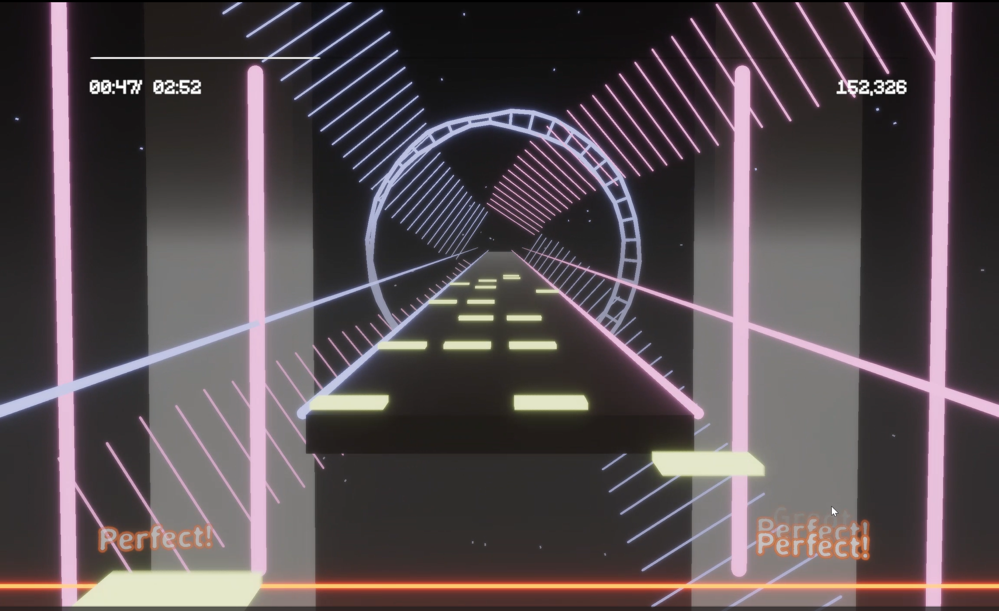
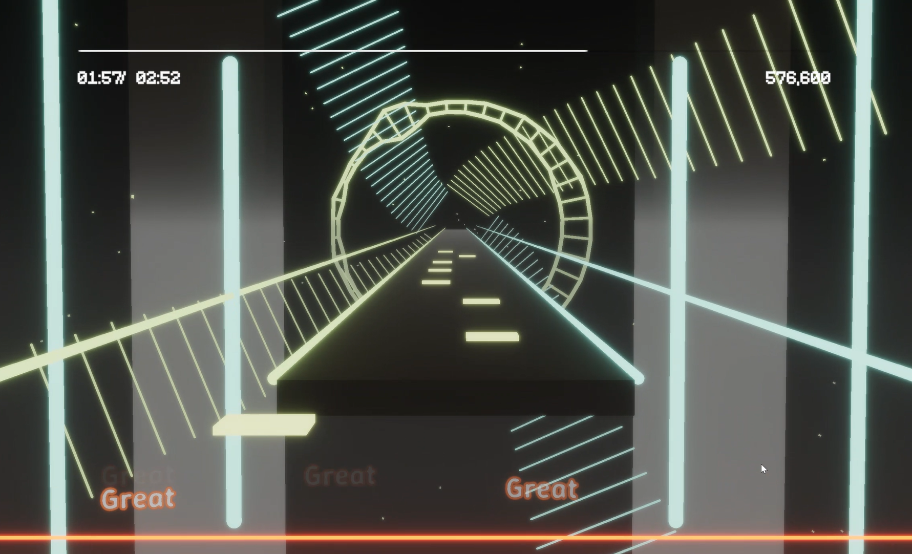

## Project planning
### Intro and Goal
I'm a rhythm game lover and I'm thinking of generating a cool music game with typical rhythm game gameplay design and many cool music visualization effects.
My goal is to build a game like a simplified beat-saber with some cool line-based visualizations.
some references.

### Reference

### Specification
The game would have:
- some crazy beat saber-style visualizations cooperating with the music
- a basic rhythm game gameplay such as project sekai or phigros
- some PCG chart for any music input

### Final Result

I choose some visualization based on basic geographic components such as circles, cubes and lines.
The music visualization includes five parts:
lines near the note track. They are visualized using the intensity of music.
two circles with lines between it. The distances are based on the spectrum.
horizontal lines. They are also visualized by the intensity, but also drum kicks. I used a plugin called beatdetection to recognize the drums.
curves with perpendicular bars. Their velocity and acceleration are controlled by overall intensity of music, and I made a little lag between two lines to beautify the result.
A particle system, for which initial speed is controlled by intensity.

Also the hue is changed when music's intensity reaches some degree.
I add some fog to it but the result isn't as beautiful as beat saber.

For the chart, I divided the whole music into several parts, each of which is about 10-20 secs, and each part is evaluated based on its properties.
I categorized these parts into three kind: low energy, mid energy and high energy.
Each of them has their own logic of procedual generated note patterns.

